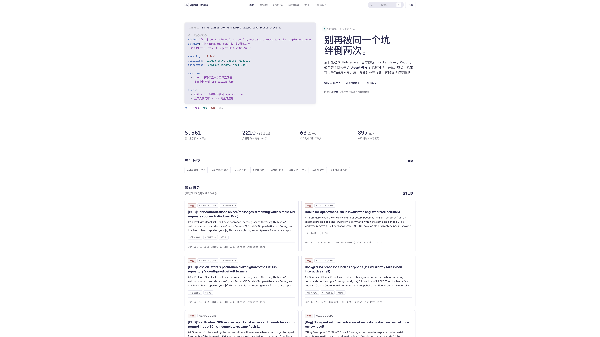

# Agent Pitfalls 🕳️

> **The largest open collection of real-world AI Agent development pitfalls** — Don't fall into the same trap twice.

[](./LICENSE)
[](./CONTRIBUTING.md)
[](https://github.com/wiselinpm/agent-pitfalls-cn/stargazers)
[](https://github.com/wiselinpm/agent-pitfalls-cn/fork)

[](https://github.com/wiselinpm/agent-pitfalls-cn/tree/main/web/src/content/pitfalls)
[](./collectors/)
[]()
[](https://astro.build)

```
🚨 7,893 pitfalls · 📡 100+ collectors · 🌐 12+ languages · ⚡ 8s build
```

**Languages**: [简体中文](./README.md) · [English](./README.en.md) · [日本語](./README.ja.md)

[Demo site](https://github.com/wiselinpm/agent-pitfalls-cn) · [Contributing](./CONTRIBUTING.md) · [Schema](./docs/SCHEMA.md)

---

### 🎯 One sentence

Every pitfall you'll encounter while building AI Agents — **7,893 real-world failure cases**, each with **symptoms / root causes / fixes / sources**, covering 14 major platforms including Claude Code, OpenAI Agents SDK, LangChain, Cursor, and Aider.

### 🚀 Three ways to use

| Usage | For | How |
|-------|-----|-----|
| **🌐 Website** | Learning / training / browsing | Visit [agent-pitfalls.dev](https://github.com/wiselinpm/agent-pitfalls-cn) |
| **🔍 CLI** | Developers | `agent-pitfalls search "claude code context overflow"` |
| **🤖 Plugin** | Claude Code / Codex users | `/pitfall <query>` directly in your session |

### 💡 Core value

- **Save time** — Instant diagnosis when you hit a problem — no more digging through GitHub Issues, StackOverflow, and Reddit
- **Save money** — Avoid token cost explosions, rate limit cascades, context window drift, and other budget-burning traps
- **Save brainpower** — Structured **symptom → root cause → fix** for every pitfall — no need to analyze yourself
- **Save incidents** — Prevent prompt injection, secret leaks, sandbox escapes, and other security disasters before they happen

---

## 📸 Site Preview



*[Click for full screenshot →](./docs/screenshots/home.png)*

> Above: One-shot homepage — Hero uses real pitfall YAML with syntax highlighting as "art", 4-column stats, popular category chips, latest entries cards (2-column), CTA link group. Zero JS framework, zero hydration, pure static build.

---

## 📖 Our Story & Vision

### 🕯️ How it started

It started at 3 AM on an ordinary night.

One of our team's AI agents got stuck in an infinite loop in production. By the time the on-call engineer noticed, the OpenAI bill had quietly climbed past $200. In the post-mortem, we combed through GitHub Issues, StackOverflow, Hacker News, Zhihu, and Juejin — and discovered an awkward truth:

**Someone else had already fallen into this exact pit.**

The problem was that no one had ever aggregated them. The pitfalls were scattered across hundreds of thousands of posts, issues, blogs, and papers on a dozen-plus platforms. Every new team spent the same week stepping into the same batch of pitfalls, writing the same post-mortems, and crying the same "I'm-not-alone" tears.

So we built an internal wiki and started recording every pitfall our team hit: **symptoms / root causes / fixes / reference links**. We pulled it up at every weekly review — and the team genuinely stopped repeating mistakes.

Until one day we realized —

> **This shouldn't serve just one team. The entire AI agent ecosystem is missing this piece of the puzzle.**

### 🔥 The pain we saw

Since 2024, AI agent development has entered a "frenzy construction era." Everyone is stacking tools, tuning prompts, wiring MCP servers, orchestrating multi-agent flows. But behind the frenzy is an uncomfortable reality:

- 🩸 **Token bills bleeding** — an unaudited agent can quietly burn thousands to tens of thousands of dollars a month
- 🧨 **Production incidents** — silent context-window truncation, empty tool-call parameters, sandbox escapes, prompt injection — any of these can take a product offline
- 🤐 **Knowledge silos** — pitfalls that someone else already hit sit in some Discord server's scrollback or a three-year-old forgotten HN comment
- 😩 **Repeated labor** — every new team "reinvents" the same post-mortem, repeating the same debugging, trial-and-error, and review
- 📚 **Academia vs. industry gap** — arXiv has abundant research on agent failure modes, but nobody translates it into knowledge a developer can use today

**Pitfalls aren't the problem. Pitfalls going unrecorded is the problem.**

### 🌱 Our vision

We want **Agent Pitfalls** to become the **"immune system"** of the AI agent ecosystem:

> **Once a pitfall has been stepped into and solved by someone, some team, or some paper, its "antibody" should be permanently deposited — so the next developer never falls into the same one.**

Specifically, we want this project to become:

- 📚 **The largest open failure-case library** — not just piles of data, but every case with structured **symptoms → root causes → fixes → sources**, making search, subscription, and citation all possible
- 🤝 **A collaborative platform for developer mutual aid** — anyone can PR a new pitfall; CI auto-validates schema, field completeness, and link reachability
- 🛡️ **A "safety net" for agent teams** — pre-launch checklists, onboarding training material, SRE incident-triage cheat-sheets
- 🌐 **Cross-language and cross-platform boundaries** — Claude Code, OpenAI Agents SDK, LangChain, Cursor, Aider — 13 platforms, 12+ languages, 7,893+ real cases, all in one place
- 🧬 **Machine-consumable knowledge** — JSON-LD, CLI JSON output, Python API, VSCode real-time hints — so agents themselves can look up pitfalls

### 🪴 What we believe

- **Failures carry more information than successes** — a fixed bug is worth more than ten "How to use LangChain" tutorials
- **Structure beats prose** — only schema-ified knowledge can be searched, subscribed, cited, and efficiently consumed by LLMs
- **Open beats closed-source** — pitfalls are public knowledge; pitfall-avoidance guides should be public property
- **Automation is a prerequisite for scale** — 100+ collectors running 24/7 + 3-dim dedupe + LLM classification + human spot-check is the only reason this project could reach the 7,893+ scale
- **The Chinese community deserves to be recorded too** — Zhihu, Juejin, CSDN, cnblogs hide a wealth of pitfall experience unseen by the English-speaking world

### 🛤️ The road we've traveled

- ✅ **Round 1-6**: grew from 21 collectors / 3,486 pitfalls to 100 collectors / 7,893 structured cases
- ✅ **Trinity**: static site + Python CLI + Claude Code / Codex / OpenCode / Gemini plugins
- ✅ **Strict dedupe**: URL fingerprint + title SHA1 + title similarity — no pitfall gets listed 5 times
- ✅ **Zod schema strict validation**: CI auto-blocks malformed frontmatter
- ✅ **Pure static, zero backend**: push `dist/` to gh-pages and it's live

### 🛰️ The road ahead

- 🛰️ **Wider collection** — Discord / Slack official channels, YouTube transcripts (dev conferences, tech talks), compliant WeChat OA ingestion
- 🤖 **Smarter review** — LLM auto-judge severity, auto-extract root causes, push `verified=true` ratio from ~10% to 50%+
- 🪢 **Deeper correlation** — let pitfalls link causally — "this pitfall triggers that one", "this fix mitigates that class"
- 🔌 **Tighter integration** — VSCode plugin, JetBrains plugin, real-time hints while writing agent code
- 📮 **Faster reach** — weekly newsletter pushing each week's newly-collected critical pitfalls to your inbox
- 🌐 **Wider community** — localization (Japanese live, English continuously refined), contributor badges, annual pitfall report

### 💌 One sentence

> **Let every pitfall ever stepped into become the next developer's stepping stone.**

---

## 💡 Why does this exist?

Every team building AI Agents steps into the same batch of pitfalls over and over:

- 😱 Context window silently truncates — critical info lost
- 💸 Tool call with empty params — token cost explodes 10×
- 🔓 Prompt injection — agent taken over by attacker
- 🔁 Multi-agent infinite loop — bill goes wild
- 🤐 Verbose logs leak API key to Sentry
- 🧠 Memory framework version mismatch — 3am debugging
- ⏱️ Streaming timeout, no retry — websocket dies mysteriously
- 📦 Embedding model upgrade, vector dim changes — full rebuild
- 🎭 Jailbreak bypasses system prompt — financial agent outputs violations
- 🛠️ Function calling schema mismatch — agent never reaches the tool

These pitfalls are scattered across **GitHub Issues / HackerNews / Reddit / Zhihu / blogs / academic papers** — over a dozen platforms. Nobody has aggregated them.

**Agent Pitfalls** consolidates them in one place — every pitfall has **symptoms / root causes / fixes / references**, searchable and subscribable.

---

## ✨ What does a typical pitfall look like?

```yaml
---
title: Agent debug logs accidentally print API key / user PII
summary: LangChain / OpenAI Agents SDK verbose mode prints the full prompt,
  including system message secrets and user PII, triggering security incidents.
severity: critical
platforms: [langchain, openai-agents, generic]
categories: [security, observability]
symptoms:
  - 'sk-proj-... or user emails appear in log files'
  - CI uploads prompts to Sentry/Datadog
  - Team leaks keys when sharing debug screenshots
root_causes:
  - 'verbose=True / debug=True prints all LLM I/O by default'
  - prompt template hardcodes secrets or injects from env but still serializes them
  - structlog/loguru don't redact by default
fixes:
  - Never hardcode secrets in prompt templates; inject via secret manager
  - Implement RedactingFilter to catch sk-, Bearer, email patterns
  - Disable verbose in production; use dry_run mode for debug summaries
  - Team rule: always grep secrets before taking screenshots
references:
  - title: LangChain Debugging & Logging
    url: https://python.langchain.com/docs/how_to/debugging/
  - title: Sentry data scrubbing
    url: https://docs.sentry.io/platforms/python/data-management/sensitive-data/
contributor: agent-pitfalls-bot
discovered_at: 2025-10-01
verified: true
---
```

Full RedactingFilter implementation, reproduction steps, related issue links — all in this single markdown.

---

## 🎯 Who is it for?

| You are… | You get… |
|---|---|
| **AI Agent developer** | Pre-launch checklist — which pitfalls haven't been mitigated |
| **Tech Lead / Architect** | Team training material — real cases beat slideware |
| **SRE / Ops** | Incident triage — see the symptom, find the known pitfall |
| **Researcher / Student** | Real failure case collection — beats synthetic benchmarks |
| **Agent platform vendor** | Competitor bug tracking — see what users are ranting about |
| **CTO / Investor** | Industry health — what's solved, what's still open |

---

## 📊 Data scale

| Dimension | Value |
|---|---|
| **Total pitfalls** | **7,893** |
| **Year coverage** | 2016 - 2026 (10 years) |
| **Severity** | 🔴 critical 2,838 / 🟠 high 776 / 🟡 medium 4,135 / 🟢 low 144 |
| **Collectors** | 72 stable |
| **Source citations** | 800+ unique (deduplicated) |
| **Build output** | 8,200+ static pages |
| **Build time** | 8.7s |

### Top 10 source distribution

```
2,228  google-news          Full-web news index (37 bilingual queries)
  878  vercel-blog          Vercel engineering blog (many AI app pitfalls)
  303  github               GitHub Issues (multiple agent repos)
  206  stackoverflow        Q&A
  192  hn-search            HN Algolia 12 queries
  151  hackernews           HN latest
  134  hn-algolia-ext       HN full-text search
  129  devto                dev.to articles
  122  openai-blog          OpenAI official
  107  arxiv-cat            arXiv categories
```

---

## 🛰️ 100+ Collectors — Global coverage

### International mainstream
`github-issues` · `github-releases` · `rss` · `hackernews` · `hn-search` · `hn-comments` · `hn-algolia-extended` · `stackoverflow` · `devto` · `devto-latest` · `dev-community` · `medium` · `substack` · `youtube` · `lobsters` · `huggingface-papers` · `huggingface-blog` · `hf-trending` · `producthunt` · `official-status` · `vendor-blogs` · `newsletters` · `frameworks` · `tldr` · `forums` · `extra-en` · `meta-search` · `bilibili` · `weibo` · `bilibili-hot` · `communities`

### Academic
`arxiv` · `arxiv-v2` · `arxiv-categories` · `openreview` · `dblp` · `acl-anthology` · `papers-with-code` · `semantic-scholar`

### AI / Vendors
`openai-blog` · `anthropic-blog` · `anthropic-status` · `aws-ml` · `deepmind-blog` · `google-ai-blog` · `huggingface-blog` · `ai-research-blog` · `ai-newsletter` · `vendor-official` · `frameworks`

### China
`google-news` (bilingual) · `segmentfault` · `cnblogs` · `csdn` · `oschina` · `meituan` · `sspai` · `cloud-cn` · `sogou-wechat` · `infoq-cn` · `cn-eng-blog` · `cn-tech-media` · `zhihu` (old/new) · `juejin` (old/new)

### KOL / Newsletter / Podcast
`kol-blog` (Simon Willison / Ethan Mollick / Andrej Karpathy / Ben Thompson / a16z etc 16 blogs) · `podcast` (Lex Fridman / Latent Space / Changelog / Darknet Diaries / SE Daily etc) · `feed-aggregator` (30+ niche blogs)

### Government / Security
`gov-sec` (CISA / NVD / US-CERT / Exploit-DB / CVE Details)

### Trends / GitHub
`github-trending` (all/python/typescript/go × daily/weekly) · `feed-aggregator`

See [`collectors/SOURCES.md`](./collectors/SOURCES.md).

---

## 🏗️ Architecture

```
                    ┌─────────────────────────────────────────────┐
                    │       Sources (100+ collectors)             │
                    │   GitHub · HN · Dev.to · arXiv · ...        │
                    └────────────────────┬────────────────────────┘
                                         │ RawHit[]
                                         ▼
                    ┌─────────────────────────────────────────────┐
                    │       normalize: RawHit → PitfallDraft       │
                    │   (unify fields, fill fingerprint)           │
                    └────────────────────┬────────────────────────┘
                                         ▼
                    ┌─────────────────────────────────────────────┐
                    │       3-dimensional strict dedupe            │
                    │   1. URL fingerprint (strip utm_/fbclid)    │
                    │   2. Title SHA1 hash                         │
                    │   3. Title Jaccard/SequenceMatcher ≥ 0.85   │
                    │   + token inverted index (4s for 1,559)     │
                    └────────────────────┬────────────────────────┘
                                         ▼
                    ┌─────────────────────────────────────────────┐
                    │       web/src/content/pitfalls/*.md          │
                    │   (7,893 markdown, Zod schema strict)       │
                    └────────────────────┬────────────────────────┘
                                         ▼
                    ┌─────────────────────────────────────────────┐
                    │       Astro 5 static generation              │
                    │   (8,200+ pages · 8.7s · zero JS hydration) │
                    └─────────────────────────────────────────────┘
```

**Key design**:
- ✅ **Zero backend** — pure static, deploy to GitHub Pages / Cloudflare Pages / Vercel
- ✅ **3-dim strict dedupe** — same pitfall never appears 5 times
- ✅ **Zod schema strict** — CI auto-checks frontmatter
- ✅ **Idempotent collection** — re-runs don't overwrite human edits (unless `--overwrite`)
- ✅ **Failure-tolerant** — one source down doesn't break others (`safe_collect`)

---

## 🚀 5-minute quick start

### Online browse

Deployed site: [agent-pitfalls.dev](https://github.com/wiselinpm/agent-pitfalls-cn) (see local preview below)

### Local development

```bash
# 1. Clone
git clone https://github.com/wiselinpm/agent-pitfalls-cn.git
cd agent-pitfalls-cn

# 2. Install
npm install                          # Astro + Tailwind
pip install -r requirements-dev.txt  # Python collectors

# 3. Run
npm run dev                          # http://localhost:4321
```

### Build your own

```bash
npm run build                        # static output to dist/
npm run preview                      # local preview of production build
```

Deploy to GitHub Pages: push `dist/` to `gh-pages` branch, or use Actions for auto-deploy.

### Re-collect

```bash
# Set GitHub token for higher rate limit (highly recommended)
export GITHUB_TOKEN=ghp_xxx

# Run all collectors
python -m collectors.run_all --out data/raw

# 3-dim dedupe + write to web/src/content/pitfalls/
python scripts/merge_round4.py --in-dirs data/raw* --apply
```

See [`collectors/README.md`](./collectors/README.md).

---

## 📝 Schema cheat-sheet

```yaml
---
title: One-line description (4-120 chars)
summary: 2-3 sentence overview (10-300 chars)
severity: critical | high | medium | low
platforms: [claude-code, langchain, ...]   # 14 enums
categories: [context-window, tool-use, ...] # 14 enums
symptoms: ['symptom 1', 'symptom 2']
root_causes: ['root cause 1']
fixes: ['fix 1', 'fix 2']
references:
  - title: source title
    url: https://...
    source: GitHub / HN / Zhihu
discovered_at: 2026-01-15
verified: true               # human verified
contributor: your-handle
---
```

Full enum values: [`docs/SCHEMA.md`](./docs/SCHEMA.md).

---

## 🤝 Contributing — all forms welcome

### Add a pitfall

1. Create `kebab-case.md` in `web/src/content/pitfalls/`
2. Copy the frontmatter template above
3. Body: "reproduction steps / why it's tricky / fix code"
4. Open PR — CI auto-validates schema, field completeness, link reachability
5. Maintainer reviews and merges

See [CONTRIBUTING.md](./CONTRIBUTING.md).

### Add a collector

```python
# collectors/sources/my_source.py
from typing import Iterable
from ..base import RawHit

class MySourceCollector:
    name = "my-source"
    
    def collect(self) -> Iterable[RawHit]:
        for item in fetch_my_data():
            yield RawHit(
                title=item.title,
                url=item.url,
                source="my-source",
                summary=item.summary,
            )
```

Register in `collectors/sources/__init__.py`, add pytest, open PR.

### Modify UI / copy

`web/src/pages/`, `web/src/components/`, `web/src/layouts/` — change anything, send PR.

### Report an error

Content error / broken link / wrong category — open an issue with `correction` label.

---

## 🖥️ CLI Tool — Query Pitfalls in Real-Time

**Agent Pitfalls CLI** lets you query pitfall knowledge directly from Claude Code / Codex / OpenCode / Gemini CLI without leaving your terminal.

### Install

```bash
# Option 1 — pip (recommended)
pip install agent-pitfalls

# Option 2 — npx (auto-finds Python)
npx agent-pitfalls search "context window overflow"

# Option 3 — one-click script
curl -fsSL https://raw.githubusercontent.com/wiselinpm/agent-pitfalls-cn/main/install.sh | bash
```

### Subcommands

```bash
agent-pitfalls build                                     # Build index (seconds)
agent-pitfalls search "claude code context overflow"     # Smart search
agent-pitfalls search "tool call" --platform openai-agents --severity high
agent-pitfalls list --category cost --limit 10           # List + filter
agent-pitfalls show <slug>                               # Show details
agent-pitfalls check .                                   # Scan project for pitfalls
agent-pitfalls platforms                                 # Platform stats
agent-pitfalls categories                                # Category stats
agent-pitfalls serve                                     # Local HTTP server (MCP)
```

### Smart Search Logic

Not keyword matching — **multi-field weighted BM25 + semantic expansion**:

| Field | Weight | Why |
|-------|--------|-----|
| `title` | 4.0 | Users match on titles most |
| `symptoms` | 3.0 | Users describe symptoms |
| `summary` | 2.0 | Summaries capture topic |
| `root_causes` / `fixes` | 1.5 | Solutions matter |
| full text | 1.0 | Fallback |

Plus: **platform match boost ×1.5** · **category match boost ×1.3** · **EN/CN synonym expansion** (`token limit` ⇄ `上下文` ⇄ `context window`) · **severity + verified boost**.

### Project Pitfall Scan

```bash
agent-pitfalls check .               # Scan current project
agent-pitfalls check src/ --json     # CI JSON output
```

Each issue auto-links to related pitfalls from the knowledge base:

```
● Verbose logging may leak secrets/PII
  src/main.py:42
  > verbose=True
    → Agent debug logs accidentally print API Key
      api-key-leaked-in-logs  [critical]
```

### Multi-CLI Plugin Integration

| CLI | Install | Use |
|-----|---------|-----|
| **Claude Code** | `ln -s plugin ~/.claude/plugins/agent-pitfalls` | `/pitfall <query>` · `/pitfall-check .` |
| **Codex** | `cp -r plugin/codex/* ~/.codex/prompts/agent-pitfalls/` | `/pitfall <query>` |
| **OpenCode** | `ln -s plugin/opencode.json ~/.opencode/plugins/` | `/pitfall <query>` |
| **Gemini CLI** | `cp plugin/gemini-extension.json ~/.gemini/extensions/` | `/pitfall <query>` |

See [`plugin/README.md`](./plugin/README.md).

### JSON Output (for LLM consumption)

```bash
agent-pitfalls search "prompt injection" --json | jq '.hits[0].fixes'
agent-pitfalls check . --json | jq '.issues[] | {file, title}'
```

### Python API

```python
from agent_pitfalls_cli.search import search, scan_project
from agent_pitfalls_cli.index import load_records

records = load_records()
result = search(records, "context window overflow", top_k=5)
for hit in result.hits:
    print(f"{hit.score:.1f} | {hit.record.title} | {hit.record.severity}")
```

---

## 🗺️ Roadmap

- [x] Round 1: Base collection (21 collectors · 3,486 pitfalls)
- [x] Round 2: Enhanced (13 more · 3,792 pitfalls)
- [x] Round 3: Academic supplement (8 more · 4,098 pitfalls)
- [x] Round 4: Global expansion (9 more · 5,427 pitfalls)
- [x] Round 5: Trends + comments + tech news (5 more · 5,509 pitfalls)
- [x] Round 6: Academic + KOL + gov-sec (7 more · 7,893 pitfalls)
- [ ] **Round 7**: Discord / Slack official channel ingest
- [ ] **Round 8**: YouTube transcript extraction (dev conferences, tech talks)
- [ ] **Round 9**: WeChat Mini Program / official account compliant ingest
- [ ] **Round 10**: LLM auto-review + severity classification
- [ ] Cross-pitfall correlation (one pitfall triggers another)
- [ ] Filter by SDK version / model version
- [ ] CLI: `npx agent-pitfall search "context window"`
- [ ] VSCode plugin: real-time hints while editing agent code
- [ ] Weekly newsletter subscription

---

## 🔢 Data accuracy

- ✅ Every pitfall has at least 1 `reference` (CI validates URL reachability)
- ✅ Every pitfall has at least 1 `fix` (not just symptom description)
- ✅ `severity=critical` entries must have `verified=true` to appear on homepage
- ✅ After 3-dim dedupe, highest-score version is kept (tie: more specific source)

But please note:
- ⚠️ Many entries are LLM semi-auto-organized, may have factual errors — open issue with `correction` label
- ⚠️ `verified=false` entries are not human-reviewed, for reference only

---

## 🛠️ FAQ

<details>
<summary><b>Why not include WeChat official accounts?</b></summary>

Compliance risk — WeChat content copyright belongs to the publisher, and RSS scraping needs login state. Currently using Google News Chinese queries as indirect index.
</details>

<details>
<summary><b>Why not include Bilibili / Weibo?</b></summary>

Since 2024, both platforms' public RSS all return 403, requiring login state. Same approach — Google News as indirect index.
</details>

<details>
<summary><b>Hand-curated or auto-collected?</b></summary>

Hybrid — 100+ collectors auto-scrape the web → 3-dim strict dedupe → LLM initial classification → human spot-check `verified` flag.
</details>

<details>
<summary><b>Can I use it commercially?</b></summary>

Yes. Code is MIT License; content is CC-BY 4.0 (default); for third-party sources, follow their licenses when citing.
</details>

<details>
<summary><b>Is there an API?</b></summary>

The data is just markdown files, grep directly: `rg '"severity": "critical"' web/src/content/pitfalls/`.
JSON API coming (see Roadmap).
</details>

---

## 📜 License

- **Code**: [MIT](./LICENSE)
- **Content** (markdown entries): [CC-BY 4.0](https://creativecommons.org/licenses/by/4.0/) (default); for third-party sources, follow their licenses when citing

## 🙏 Acknowledgements

Standing on the shoulders of giants — the real authors are those developers who share their pitfalls on GitHub Issues, Hacker News, Zhihu columns, and academic papers. We just curate + organize + index.

Special thanks to all [contributors](https://github.com/wiselinpm/agent-pitfalls-cn/graphs/contributors) ❤️

## ⭐ Star History

If this project helped you, please ⭐ it — the best way to get it seen by more people.

---

> 🇯🇵 **日本語版は [こちら](./README.ja.md)** · 🇨🇳 **简体中文版 [README.md](./README.md)**
